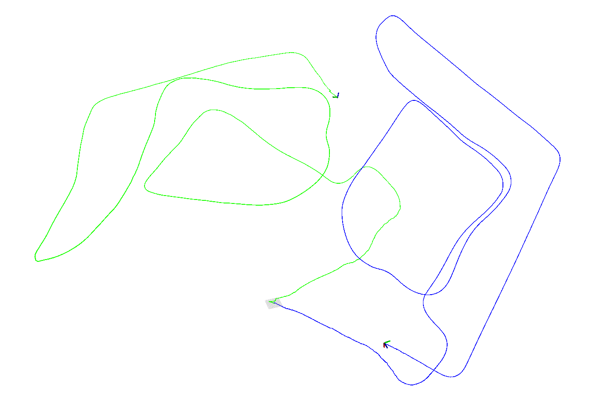

# Learning_localization_from_scratch_ws
## evo(kitti/tum)
```
mkdir src/data
cd src/kaist_tool/kaist2bag/scripts/
pip3 install -r requirements.txt
python3 kaist2evo.py
roslaunch lio_sam run.launch 
```

```
cd src/data
evo_traj tum tum_lio_sam_pose.txt --ref=tum_ground_truth.txt -a -p
```

## 基于LIO-SAM的建图

#### 数据集
[Complex Urban Dataset](https://sites.google.com/view/complex-urban-dataset/download-lidar#h.sa42osfdnwst)

本次测试采用urban08，使用方式见：https://blog.csdn.net/tiancailx/article/details/125782157?spm=1001.2014.3001.5501

#### 代码改动
- 将左右点云转换到IMU系下并合并点云，配置文件中添加Lidar到IMU的外参
- 替换原始EKF节点，增加原始gps数据转Odometry节点，发布因子图需要的gps数据类型
- 去除原代码中ring和time字段的检查，在数据集转rosbag过程中添加此字段
- 代码中一些参数的改动，IMU频率，是否启用gps，IMU内参


#### 测试效果

```
evo_traj kitti kitti_vrs_gps.txt kitti_lio_sam_pose.txt --ref=kitti_ground_truth.txt -p --plot_mode xy
```

无gps约束



有gps约束


